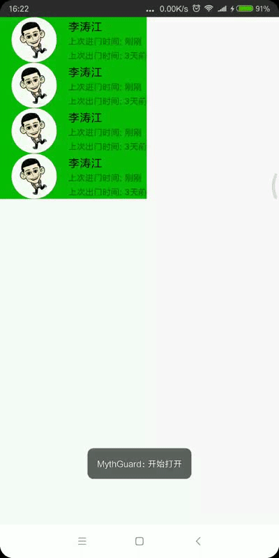

# AndroidWidget
Useful Android Widget Library
1. SwipeLayout 用于实现RecyclerView实现Item侧滑效果
2. FacePreview 用于摄像头扫描 （2018年3月19日 新增）

# 效果图



# 使用步骤

#### 1. 在Module(app模块)的build.gradle添加依赖

```
dependencies {
  compile 'cn.ltaoj.widget:widget:0.9.8'
}
```

#### 2. 新建activity_test布局文件

```
<?xml version="1.0" encoding="utf-8"?>
<android.support.constraint.ConstraintLayout
    xmlns:android="http://schemas.android.com/apk/res/android"
    android:layout_width="match_parent"
    android:layout_height="match_parent">

    <android.support.v7.widget.RecyclerView
        android:id="@+id/recycler_view"
        android:scrollbars="vertical"
        android:layout_width="match_parent"
        android:layout_height="match_parent">
    </android.support.v7.widget.RecyclerView>

</android.support.constraint.ConstraintLayout>
```

#### 3. 新建item_member_list.xml布局文件，用于显示RecycleView显示每个条目

**可以看到这个布局文件根布局为SwipeLayout控件，使用这个控件需要注意以下点：**
- SwipeLayout下需要有两个ViewGroup子视图
- 第一个子视图为backLayout
- 第二个子视图为frontLayout
- 子视图顺序不能相反，否则估计你将会看到相反的结果

```
<?xml version="1.0" encoding="utf-8"?>
<cn.ltaoj.widget.SwipeLayout
    xmlns:android="http://schemas.android.com/apk/res/android"
    android:layout_width="match_parent"
    android:layout_height="@dimen/member_item_height"
    android:id="@+id/swipe_layout">

    <LinearLayout
        android:layout_width="wrap_content"
        android:layout_height="match_parent">

        <TextView
            android:id="@+id/delete"
            android:layout_width="wrap_content"
            android:layout_height="match_parent"
            android:text="@string/iml_back_delete"
            android:textSize="@dimen/text_size_16"
            android:textColor="@color/colorWhite"
            android:background="@color/colorRed"
            android:gravity="center"
            android:paddingLeft="@dimen/text_delete_padding"
            android:paddingStart="@dimen/text_delete_padding"
            android:paddingEnd="@dimen/text_delete_padding"
            android:paddingRight="@dimen/text_delete_padding"/>
    </LinearLayout>

    <android.support.constraint.ConstraintLayout
        xmlns:android="http://schemas.android.com/apk/res/android"
        xmlns:app="http://schemas.android.com/apk/res-auto"
        android:layout_width="match_parent"
        android:layout_height="match_parent"
        android:background="@color/colorGreen"
        android:id="@+id/front_layout">

        <cn.ltaoj.circleimageview.CircleImageView
            android:id="@+id/member_avatar"
            android:layout_width="@dimen/circle_image_size"
            android:layout_height="@dimen/circle_image_size"
            android:src="@mipmap/iv_default_avatar"
            android:scaleType="fitCenter"
            app:civ_border_width="1dip"
            app:civ_border_color="@color/colorImageBorder"
            app:civ_oval="true"
            android:layout_margin="@dimen/activity_horizontal_margin"
            app:layout_constraintLeft_toLeftOf="parent"
            app:layout_constraintTop_toTopOf="parent"
            app:layout_constraintBottom_toBottomOf="parent"/>

        <TextView
            android:id="@+id/text_name"
            android:layout_width="wrap_content"
            android:layout_height="wrap_content"
            android:text="@string/text_default"
            android:textSize="@dimen/text_size_16"
            android:textColor="@color/colorBlack"
            android:layout_marginLeft="@dimen/activity_horizontal_margin"
            android:layout_marginTop="@dimen/space_margin"
            app:layout_constraintLeft_toRightOf="@id/member_avatar"
            app:layout_constraintTop_toTopOf="@id/member_avatar"/>

        <TextView
            android:id="@+id/text_last_in"
            android:layout_width="wrap_content"
            android:layout_height="wrap_content"
            android:text="@string/iml_last_in"
            android:textSize="@dimen/text_size_12"
            android:layout_marginLeft="@dimen/activity_horizontal_margin"
            android:layout_marginTop="@dimen/space_margin"
            app:layout_constraintLeft_toRightOf="@id/member_avatar"
            app:layout_constraintTop_toBottomOf="@id/text_name"/>

        <TextView
            android:id="@+id/text_in_time"
            android:layout_width="wrap_content"
            android:layout_height="wrap_content"
            android:text="@string/text_default_datetime"
            android:textSize="@dimen/text_size_12"
            android:layout_marginLeft="@dimen/tab_margin"
            android:layout_marginTop="@dimen/space_margin"
            app:layout_constraintLeft_toRightOf="@id/text_last_in"
            app:layout_constraintTop_toBottomOf="@id/text_name"/>

        <TextView
            android:id="@+id/text_last_out"
            android:layout_width="wrap_content"
            android:layout_height="wrap_content"
            android:text="@string/iml_last_out"
            android:textSize="@dimen/text_size_12"
            android:layout_marginLeft="@dimen/activity_horizontal_margin"
            android:layout_marginBottom="@dimen/space_margin"
            app:layout_constraintLeft_toRightOf="@id/member_avatar"
            app:layout_constraintBottom_toBottomOf="@id/member_avatar"/>

        <TextView
            android:id="@+id/text_out_time"
            android:layout_width="wrap_content"
            android:layout_height="wrap_content"
            android:text="@string/text_default_datetime"
            android:textSize="@dimen/text_size_12"
            android:layout_marginLeft="@dimen/tab_margin"
            android:layout_marginBottom="@dimen/space_margin"
            app:layout_constraintLeft_toRightOf="@id/text_last_out"
            app:layout_constraintBottom_toBottomOf="@id/member_avatar"/>
    </android.support.constraint.ConstraintLayout>

</cn.ltaoj.widget.SwipeLayout>
```

#### 4. 自定义Adapter类
```
package cn.ltaoj.mythguard.ui.adapter;

import android.content.Context;
import android.support.constraint.ConstraintLayout;
import android.support.v7.widget.RecyclerView;
import android.util.Log;
import android.view.LayoutInflater;
import android.view.MotionEvent;
import android.view.View;
import android.view.ViewGroup;
import android.widget.TextView;

import java.util.List;

import cn.ltaoj.circleimageview.CircleImageView;
import cn.ltaoj.mythguard.R;
import cn.ltaoj.mythguard.bean.MemberItem;
import cn.ltaoj.widget.SwipeLayout;

/**
 * Created by ltaoj on 2018/3/6 3:07.
 */

public class MemberItemAdapter extends RecyclerView.Adapter<MemberItemAdapter.ViewHolder> {
    private static final String TAG = "MemberItemAdapter";

    public interface OnMemberItemClickListener {

        void onOpen(SwipeLayout swipeLayout);

        void onClose(SwipeLayout swipeLayout);

        void onSwiping(SwipeLayout swipeLayout);

        void onStartOpen(SwipeLayout swipeLayout);

        void onStartClose(SwipeLayout swipeLayout);

        void onFrontLayout(int position);

        void onDelete(int position);
    }

    private OnMemberItemClickListener onMemberItemClickListener;
    private List<MemberItem> memberList;
    private Context context;
    private SwipeLayout preLayout;

    public MemberItemAdapter(Context context, List<MemberItem> memberList) {
        this.context = context;
        this.memberList = memberList;
    }

    public void setOnMemberItemClickListener(OnMemberItemClickListener onMemberItemClickListener) {
        this.onMemberItemClickListener = onMemberItemClickListener;
    }

    public SwipeLayout getPreLayout() {
        return preLayout;
    }

    @Override
    public ViewHolder onCreateViewHolder(ViewGroup parent, int viewType) {
        View view = LayoutInflater.from(context).inflate(R.layout.item_member_list, parent, false);
        return new ViewHolder(view);
    }

    @Override
    public void onBindViewHolder(final ViewHolder holder, final int position) {

        holder.memberAvatar.setImageResource(R.mipmap.iv_default_avatar);
        holder.textName.setText("李涛江");
        holder.textInTime.setText("刚刚");
        holder.textOutTime.setText("3天前");
        Log.i(TAG, "onBindViewHolder: " + holder.swipeLayout.getWidth());

        holder.swipeLayout.setOnSwipeChangeLintener(new SwipeLayout.OnSwipeChangeLintener() {
            @Override
            public void onStartOpen(SwipeLayout swipeLayout) {
                if (preLayout != null && preLayout != swipeLayout) {
                    preLayout.close();
                }

                if (onMemberItemClickListener != null) {
                    onMemberItemClickListener.onStartOpen(swipeLayout);
                }
            }

            @Override
            public void onOpen(SwipeLayout swipeLayout) {
                preLayout = swipeLayout;

                if (onMemberItemClickListener != null) {
                    onMemberItemClickListener.onStartOpen(swipeLayout);
                }
            }

            @Override
            public void onStartClose(SwipeLayout swipeLayout) {
                if (onMemberItemClickListener != null) {
                    onMemberItemClickListener.onStartClose(swipeLayout);
                }

                if (preLayout != null) {
                    preLayout = null;
                }
            }

            @Override
            public void onClose(SwipeLayout swipeLayout) {
                if (onMemberItemClickListener != null) {
                    onMemberItemClickListener.onClose(swipeLayout);
                }

                if (preLayout != null && preLayout == swipeLayout) {
                    preLayout = null;
                }
            }

            @Override
            public void onSwiping(SwipeLayout swipeLayout) {
                if (onMemberItemClickListener != null) {
                    onMemberItemClickListener.onSwiping(swipeLayout);
                }
            }
        });

        holder.frontLayout.setOnTouchListener(new View.OnTouchListener() {
            @Override
            public boolean onTouch(View v, MotionEvent event) {
                return false;
            }
        });

        holder.frontLayout.setOnClickListener(new View.OnClickListener() {
            @Override
            public void onClick(View v) {
                Log.i(TAG, "onClick: frontLayout");
                if (preLayout != null) {
                    preLayout.close();
                } else if (holder.swipeLayout.getSwipState() == SwipeLayout.SwipeState.OPEN) {
                    Log.i(TAG, "onClick: frontLayout:selfClose");
                    holder.swipeLayout.close();
                } else if (onMemberItemClickListener != null){
                    Log.i(TAG, "onClick: frontLayout:onFrontLayout");
                    onMemberItemClickListener.onFrontLayout(position);
                }
            }
        });

        holder.delete.setOnClickListener(new View.OnClickListener() {
            @Override
            public void onClick(View v) {
                Log.i(TAG, "onClick: delete");
                if (onMemberItemClickListener != null) {
                    onMemberItemClickListener.onDelete(position);
                }
            }
        });
    }

    @Override
    public int getItemCount() {
        return memberList.size();
    }

    public class ViewHolder extends RecyclerView.ViewHolder {

        private SwipeLayout swipeLayout;
        private TextView delete;
        private ConstraintLayout frontLayout;
        private CircleImageView memberAvatar;
        private TextView textName;
        private TextView textLastIn;
        private TextView textInTime;
        private TextView textLastOut;
        private TextView textOutTime;


        public ViewHolder(View itemView) {
            super(itemView);
            swipeLayout = itemView.findViewById(R.id.swipe_layout);
            delete = itemView.findViewById(R.id.delete);
            frontLayout = itemView.findViewById(R.id.front_layout);
            memberAvatar = itemView.findViewById(R.id.member_avatar);
            textName = itemView.findViewById(R.id.text_name);
            textLastIn = itemView.findViewById(R.id.text_last_in);
            textInTime = itemView.findViewById(R.id.text_in_time);
            textLastOut = itemView.findViewById(R.id.text_last_out);
            textOutTime = itemView.findViewById(R.id.text_out_time);
        }
    }
}
```

#### 5. 新建TestActivity

```
package cn.ltaoj.mythguard.ui.activity;

import android.os.Bundle;
import android.support.annotation.Nullable;
import android.support.v7.widget.LinearLayoutManager;
import android.support.v7.widget.RecyclerView;
import android.view.View;
import android.widget.AbsListView;
import android.widget.Toast;

import java.util.List;
import java.util.concurrent.CopyOnWriteArrayList;

import cn.ltaoj.mythguard.R;
import cn.ltaoj.mythguard.base.MVPBaseActivity;
import cn.ltaoj.mythguard.bean.MemberItem;
import cn.ltaoj.mythguard.mvp.presenter.BasePresenter;
import cn.ltaoj.mythguard.ui.adapter.MemberItemAdapter;
import cn.ltaoj.widget.SwipeLayout;

/**
 * Created by ltaoj on 2018/3/6 13:23.
 */

public class TestActivity extends MVPBaseActivity {

    private MemberItemAdapter mAdapter;
    private List<MemberItem> memberList = new CopyOnWriteArrayList<>();

    @Override
    protected void onCreate(@Nullable Bundle savedInstanceState) {
        super.onCreate(savedInstanceState);
        setContentView(R.layout.activity_test);
        initToolbar();
        initView();
        initData();
    }

    @Override
    protected void initView() {
        LinearLayoutManager manager = new LinearLayoutManager(getApplicationContext());
        manager.setOrientation(LinearLayoutManager.VERTICAL);
        RecyclerView recyclerView = this.findViewById(R.id.recycler_view);
        recyclerView.setLayoutManager(manager);
        mAdapter = new MemberItemAdapter(getApplicationContext(), memberList);
        recyclerView.addOnScrollListener(new RecyclerView.OnScrollListener() {
            @Override
            public void onScrollStateChanged(RecyclerView recyclerView, int newState) {
                if (newState == AbsListView.OnScrollListener.SCROLL_STATE_TOUCH_SCROLL) {
                    SwipeLayout preLayout = mAdapter.getPreLayout();
                    if (preLayout != null) {
                        preLayout.close();
                    }
                }
            }

            @Override
            public void onScrolled(RecyclerView recyclerView, int dx, int dy) {
                super.onScrolled(recyclerView, dx, dy);
            }
        });
        mAdapter.setOnMemberItemClickListener(new MemberItemAdapter.OnMemberItemClickListener() {
            @Override
            public void onOpen(SwipeLayout swipeLayout) {
                Toast.makeText(getApplicationContext(), "打开", Toast.LENGTH_SHORT).show();
            }

            @Override
            public void onClose(SwipeLayout swipeLayout) {
                Toast.makeText(getApplicationContext(), "关闭", Toast.LENGTH_SHORT).show();
            }

            @Override
            public void onSwiping(SwipeLayout swipeLayout) {
//                Toast.makeText(getApplicationContext(), "滑动", Toast.LENGTH_SHORT).show();
            }

            @Override
            public void onStartOpen(SwipeLayout swipeLayout) {
                Toast.makeText(getApplicationContext(), "开始打开", Toast.LENGTH_SHORT).show();
            }

            @Override
            public void onStartClose(SwipeLayout swipeLayout) {
                Toast.makeText(getApplicationContext(), "开始关闭", Toast.LENGTH_SHORT).show();
            }

            @Override
            public void onFrontLayout(int position) {
                Toast.makeText(getApplicationContext(), "查看详细信息", Toast.LENGTH_SHORT).show();
            }

            @Override
            public void onDelete(int position) {
                Toast.makeText(getApplicationContext(), "删除", Toast.LENGTH_SHORT).show();
                memberList.remove(position);
                mAdapter.notifyDataSetChanged();
            }
        });
        recyclerView.setAdapter(mAdapter);
    }

    @Override
    protected void initData() {
        for (int i = 0;i < 5;i++) {
            memberList.add(new MemberItem());
        }
    }

    @Override
    protected BasePresenter createPresenter() {
        return null;
    }

    @Override
    public void onClick(View v) {

    }
}

```
